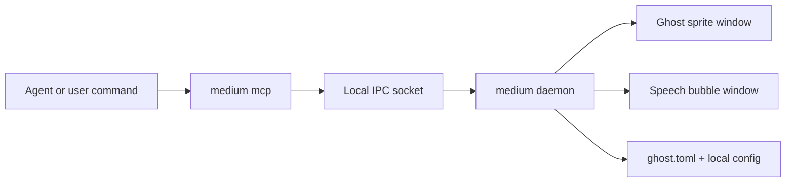
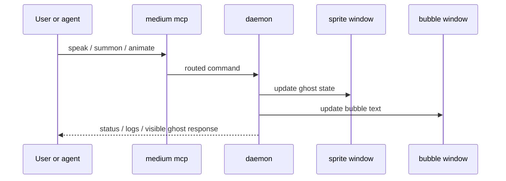

# Medium

Medium is a local desktop runtime for ghost avatars. It combines a Tauri daemon, an MCP bridge, a manifest-driven ghost format, and a small toolchain for validating and importing ghost assets.

## What it provides

- multi-ghost desktop windows
- speech bubbles, animation control, and optional TTS
- a local daemon plus IPC socket
- an MCP bridge for agent control
- ghost validation, preview, and import commands

## Default ghost credit

The bundled default ghost is **`vita`**.

Art credit for the bundled default ghost:

- **Author:** `@ArksDigital`
- **Website:** <https://arks.digital/>

The bundled manifest keeps attribution metadata, while avoiding local path leakage in the committed repo copy.

## Architecture





## Repository layout

```text
medium/
  src/                 Frontend app and bundled ghost assets
    assets/ghosts/     Bundled ghost folders and ghost.toml manifests
  src-tauri/           Rust daemon, CLI, IPC, MCP bridge, validation logic
  scripts/             Developer helper scripts
  CONTROL_MEDIUM_SKILL.md
```

## Core commands

```bash
medium daemon
medium mcp --ghost vita
medium init
medium doctor
medium status
medium logs --lines 100
medium logs --filter Summoned --follow
medium ghosts list
medium ghosts validate ./path/to/ghost
medium ghosts preview ./path/to/ghost
medium ghosts import aseprite ./path/to/pack --name imported-ghost --sheet exported.png
```

## Development workflow

Install frontend dependencies once:

```bash
npm install
```

Common development commands:

```bash
npm run build
npm run redeploy:daemon
```

`npm run redeploy:daemon` is the safest workflow after runtime changes because it:

1. builds the frontend
2. reinstalls the `medium` binary
3. stops the old daemon
4. removes stale socket state if needed
5. starts the daemon again
6. prints `medium status`

## Config and local paths

Medium commonly uses:

- config: `~/.medium/config.toml`
- daemon log: `~/.medium/daemon.log`
- default socket: `/tmp/medium_ghost_default_cmd.sock`
- local ghost library: `~/.medium/ghosts`
- Claude MCP config: `~/.claude/.mcp.json`

## Ghost manifest

Each ghost folder must contain `ghost.toml`.

The frontend and daemon use the manifest as the source of truth for:

- frame size
- FPS
- scale
- animation list
- initial animation
- provenance metadata

Example:

```toml
[ghost]
name = "vita"
description = "A bundled vita ghost imported from the Arks Digital dino pack."

[provenance]
source_type = "aseprite-pack"
artist = "Arks"
attribution = "@ArksDigital — https://arks.digital/"

[sprite]
enabled = true
frame_width = 24
frame_height = 24
fps = 8
scale = 4.0
flip_horizontal = false
initial_animation = "idle"

[[sprite.animations]]
file = "resources/animations/idle.png"
name = "idle"
intent = "Imported idle animation from an Aseprite-style source pack."
```

## Validation rules

`medium ghosts validate <path>` checks:

- `ghost.toml` exists
- the ghost path exists and is a directory
- `ghost.name` and `ghost.description` are non-empty
- `provenance.source_type` is non-empty when provenance is present
- `sprite.frame_width`, `sprite.frame_height`, and `sprite.fps` are greater than zero
- `sprite.scale` defaults to `1.0` and must be greater than zero
- `sprite.animations` includes `idle`

Example:

```bash
medium ghosts validate src/assets/ghosts/vita
```

## Importing ghosts

### Exported sheet or pack directory

```bash
medium ghosts import aseprite ./dino-pack \
  --name doux \
  --sheet "DinoSprites - doux.png" \
  --artist "Arks" \
  --attribution "@ArksDigital — https://arks.digital/"
```

### Raw `.ase` / `.aseprite`

If the full Aseprite CLI is installed, Medium can import directly from a raw source file:

```bash
export MEDIUM_ASEPRITE_BIN="/Applications/Aseprite.app/Contents/MacOS/aseprite"

medium ghosts import aseprite ./dino-pack/aseprite/doux.ase \
  --name doux \
  --artist "Arks" \
  --attribution "@ArksDigital — https://arks.digital/"
```

### Import behavior

- sheet-only imports fall back to a single `idle` strip
- raw `.ase` imports use the Aseprite CLI to export a temporary sheet plus metadata
- when Aseprite tag metadata exists, Medium emits one animation strip per tag such as `idle`, `run`, or `jump`

## Releases

The public repo includes a GitHub Actions release workflow at:

- `.github/workflows/release.yml`

Release flow:

1. sync the latest `medium/` snapshot to the public repo
2. push a tag like `v0.1.0` to the public repo, or run the workflow manually with `release_tag`
3. GitHub Actions builds Tauri binaries on macOS, Linux, and Windows
4. the workflow creates a draft GitHub Release and uploads the build artifacts

Notes:

- the release workflow lives inside `medium/.github/workflows/` in the monorepo so it lands at the public repo root after sync
- the public sync workflow in the monorepo publishes only the tracked `medium/` snapshot, so local asset folders do not leak into the public repo

## Key implementation files

- `src/ghosts.ts` — frontend loader for bundled ghost manifests
- `src/main.ts` — sprite runtime and bubble coordination
- `src-tauri/src/main.rs` — CLI entrypoint
- `src-tauri/src/manifest.rs` — manifest schema and validation
- `src-tauri/src/ghost_manager.rs` — ghost window lifecycle and sizing
- `src-tauri/src/cli/import.rs` — importer dispatch / extension point
- `src-tauri/src/cli/import/aseprite.rs` — Aseprite importer implementation
- `src-tauri/src/cli/validate.rs` — manifest validation command
- `scripts/redeploy-daemon.sh` — rebuild and daemon restart helper
