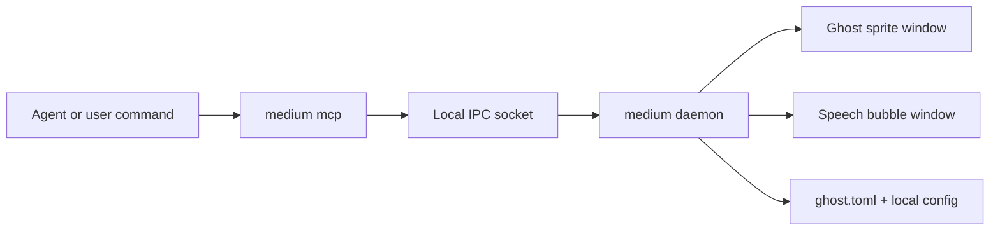
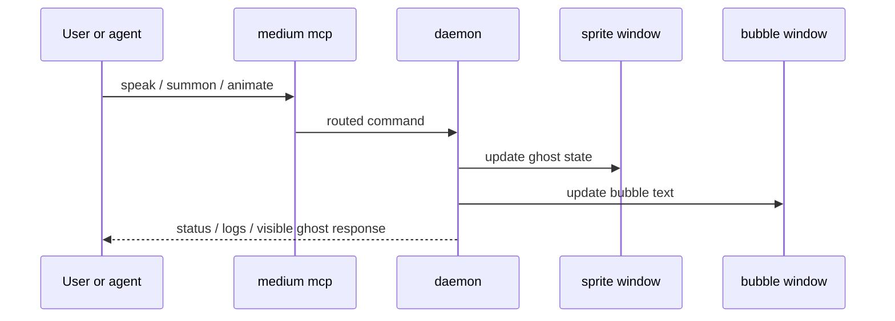

# Architecture

Medium combines a Tauri daemon, an MCP bridge, and a manifest-driven ghost format into a cohesive system for controlling sprite-based avatars.

## System design

## Command flow

## Key components

- **Frontend (TypeScript)** — sprite rendering, bubble coordination, ghost manifest loading
- **Daemon (Rust)** — CLI, IPC socket server, window lifecycle management
- **MCP bridge** — exposes daemon commands to agents and Claude Code
- **Ghost manifests** — TOML-based format for frame size, animations, metadata, and provenance

See [Development](development.md#key-implementation-files) for a detailed file map.
